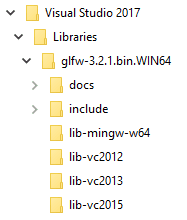
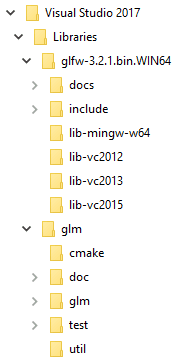
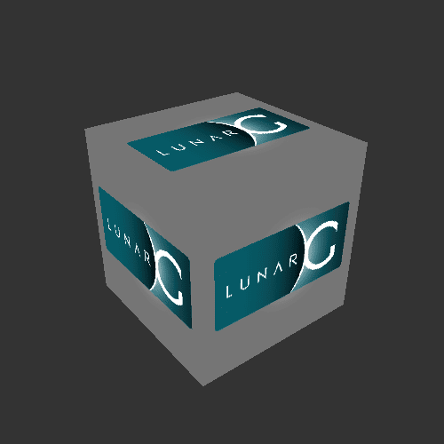
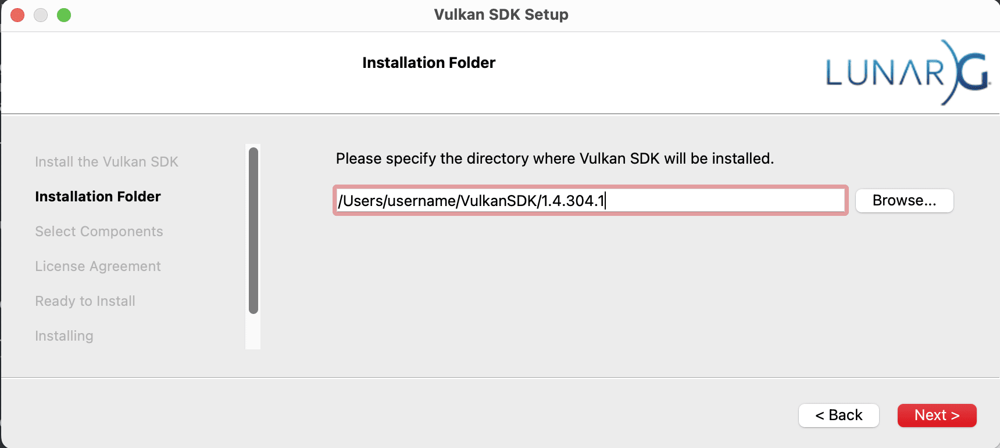
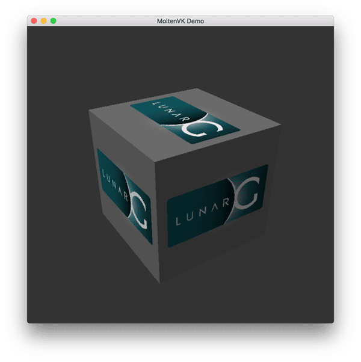
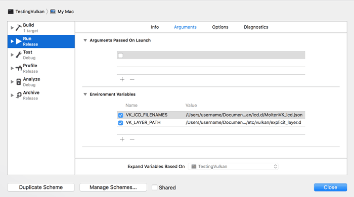

= 概述
:toc:
:toclevels: 3
:toc-title: 目录

本章将搭建 Vulkan 应用开发环境并安装一些实用库。除编译器外，我们将使用的所有工具都兼容 Windows、Linux 和 macOS，但它们的安装步骤略有不同，因此在此分别介绍。

== 获取代码
首先，我们需要从 https://github.com/KhronosGroup/Vulkan-Tutorial[GitHub 仓库]克隆教程代码。这需要安装 https://git-scm.com/[git]版本控制系统。

安装 git 后，我​​们可以像这样在本地克隆仓库：

[source,bash]
----
git clone https://github.com/KhronosGroup/Vulkan-Tutorial
----

这将把存储库克隆到一个名为 `Vulkan-Tutorial` 的新文件夹（位于当前文件夹内）。各章节的源文件位于该文件夹的attachments文件夹中。

== 依赖项安装脚本
为了简化安装过程，我们提供了适用于 Windows 和 Linux 的依赖项安装脚本：

=== Windows
对于 Windows 系统，我们提供了一个脚本，该脚本使用 vcpkg 安装所有必需的依赖项：

. 请确保您已安装 https://github.com/microsoft/vcpkg[vcpkg]。如果尚未安装，请按照 https://github.com/microsoft/vcpkg上的说明进行操作。
. 运行scripts/install_dependencies_windows.bat脚本
. 按照说明安装 Vulkan SDK

虽然我们使用 vcpkg 来启用此安装脚本，但整个过程详述如下，即使不使用安装脚本或 vcpkg 也可以完成。使用 vcpkg 只是为了方便安装过程。

=== Linux
对于 Linux 系统，我们提供了一个脚本，可以检测您的软件包管理器并安装所有必需的依赖项：

. 运行scripts/install_dependencies_linux.sh脚本
. 按照说明安装 Vulkan SDK

如果您更喜欢手动安装依赖项，或者您使用的是 macOS，请按照以下特定于平台的说明进行操作。

== 共同考虑因素
=== Vulkan SDK
开发 Vulkan 应用最重要的部分是 SDK。它包含头文件、标准验证层、调试工具以及 Vulkan 函数加载器。加载器会在运行时查找驱动程序中的函数，类似于 OpenGL 的 GLEW 加载器——如果您熟悉 GLEW 的话。

用户可从 https://vulkan.lunarg.com/sdk/home[LunarG 网站]下载 SDK 。

继续完成安装，并注意 SDK 的安装位置。首先，我们需要验证您的显卡和驱动程序是否正确支持 Vulkan。请转到 SDK 的安装目录，打开该bin目录并运行vkcube演示程序。

此目录中还有一个对开发有用的程序。这个slangc命令行程序用于将人类可读的 https://shader-slang.org/slang/user-guide/[Slang 着色器语言]编译成字节码。我们将在 xref:画一个三角形/图形管线基础知识/着色器模块.adoc[着色器模块章节]中详细介绍 。该bin目录还包含 Vulkan 加载器和验证层的二进制文件，而该lib目录则包含库文件。

最后，还有一个include包含 Vulkan 头文件的目录。您可以随意浏览其他文件，但本教程不需要用到它们。

为了自动设置 VulkanSDK 用于简化 CMake 项目配置和其他工具的环境变量，我们建议在 Linux 系统上使用setup-env脚本。您可以将此脚本添加到终端的启动项或 IDE 设置中，以确保这些环境变量在所有会话中都可用。

如果收到错误信息，请确保您的驱动程序已更新至最新版本，包含 Vulkan 运行时环境，并且您的显卡受支持。 有关主要厂商驱动程序的链接，请参阅 xref:简介.adoc[简介章节]。

=== CMake
尽管在跨平台项目开发存在诸多不足，但是CMake 已成为业界的标配工具。它允许开发者创建项目范围的构建描述文件，该文件负责设置和配置创建任何项目所需的所有支持工具。其他构建系统，例如 Bazel，也具备类似的功能，但没有哪个系统能像 CMake 那样被广泛使用和接受。本教程篇幅有限，无法详细介绍 CMake 的使用方法，但您可以在 http://www.cmake.org/[CMake 网站]上找到更多相关信息。

Vulkan SDK 支持使用 `find_package`。要在你的项目中使用它，你可以将 `*-config.cmake` 的搜索路径添加到 `find_package` 配置调用的 `HINTS` 部分，即：

[source,cmake]
----
find_package(slang CONFIG HINTS "$ENV{VULKAN_SDK}/lib/cmake")
----
未来，FindVulkan.cmake 可能会迁移到 *-config.cmake 标准，但截至撰写本文时，建议从 VulkanSamples 获取 FindVulkan.cmake，因为 Kitware 提供的版本已弃用，并且在 macOS 构建中存在错误。您可以在代码目录中找到它，文件名为FindVulkan.cmake。

FindVulkan.cmake 是一个项目特定的文件，您可以根据需要对其进行修改，使其在您的构建环境中良好运行，并可根据您的需求进一步定制。Khronos 在 VulkanSamples 中提供的版本经过充分测试，是一个很好的起点。

要使用它，请像这样将其添加到 CMAKE_MODULE_PATH 中：

[source,cmake]
----
list(APPEND CMAKE_MODULE_PATH "${CMAKE_CURRENT_LIST_DIR}/CMake")
----
这样一来，其他通过 Find*.cmake 分发的项目就可以放在同一个文件夹中。 有关可运行项目的示例，请参阅随附的 xref:CMakeLists.txt[CMakeLists.txt文件]。

Vulkan C++ 头文件还提供了一个 C++ 模块。C++ 模块的一大优势在于，它能提供 C++ 的所有优点，而无需耗费大量的编译时间。要使用它们，必须针对目标设备编译 .cppm 文件。

NOTE: Vulkan C++ 头文件中的模块支持仍处于实验阶段，可能无法与所有编译器兼容。除非您想进行实验，否则建议*不要*使用它们。

要在附件模板中启用 Vulkan C++20 模块，请使用以下命令配置 CMake：

[source,bash]
----
cmake -DENABLE_CPP20_MODULE=ON ..
----

启用后，CMakeLists.txt 文件将包含自动构建模块所需的所有指令。相关代码片段如下所示：

[source,cmake]
----
find_package (Vulkan REQUIRED)

# 设置C++模块 (当 ENABLE_CPP20_MODULE=ON时)
add_library(VulkanCppModule)
add_library(Vulkan::cppm ALIAS VulkanCppModule)

target_compile_definitions(VulkanCppModule PUBLIC
        VULKAN_HPP_DISPATCH_LOADER_DYNAMIC=1
        VULKAN_HPP_NO_STRUCT_CONSTRUCTORS=1
)

target_include_directories(VulkanCppModule PRIVATE "${Vulkan_INCLUDE_DIR}")

target_link_libraries(VulkanCppModule PUBLIC Vulkan::Vulkan)

set_target_properties(VulkanCppModule PROPERTIES CXX_STANDARD 20)

target_sources(VulkanCppModule
        PUBLIC
        FILE_SET cxx_modules TYPE CXX_MODULES
        BASE_DIRS "${Vulkan_INCLUDE_DIR}"
        FILES "${Vulkan_INCLUDE_DIR}/vulkan/vulkan.cppm"
)
----
VulkanCppModule 目标只需定义一次，然后将其添加到使用该模块的项目依赖项中，它就会自动构建。您无需再将 Vulkan::Vulkan 添加到项目中。

[source,cmake]
----
target_link_libraries (${PROJECT_NAME} Vulkan::cppm)
----
如果您选择保持模块禁用（默认设置），则可以继续使用传统的基于头文件的包含方式（例如 `#include <vulkan/vulkan_raii.hpp>`）。附件中的示例代码在两种方式下均可编译，并且仅当 `ENABLE_CPP20_MODULE=ON`（该选项会定义 `USE_CPP20_MODULES`）时才会导入模块。

=== 窗口管理
如前所述，Vulkan 本身是一个平台无关的 API，并不包含用于创建窗口以显示渲染结果的工具。为了充分利用 Vulkan 的跨平台优势，我们将使用 http://www.glfw.org/[GLFW] 库来创建窗口，该库支持 Windows、Linux 和 macOS。虽然还有其他库可以实现此功能，例如 https://www.libsdl.org/[SDL]，但 GLFW 的优势在于，除了窗口创建之外，它还抽象化了 Vulkan 中一些其他平台特定的细节。

一个令人遗憾的是，GLFW 无法在 Android 或 iOS 系统上运行；它仅适用于桌面平台。SDL 的确提供了移动端支持；然而，移动窗口支持的最佳实现方式是通过与操作系统交互，例如在 Android 中使用 JNI。

=== 广义线性模型
与 DirectX 12 不同，Vulkan 没有包含线性代数运算库，所以我们需要下载一个。 http://glm.g-truc.net/[GLM]是一个不错的库，它专为图形 API 设计，也常用于 OpenGL。

=== 纹理库
Vulkan 本身不支持读取各种纹理资源，例如 png、jpeg 或 ktx 文件。然而，由于这是一个庞大的主题，本教程无法全面深入地探讨所有格式。在本教程中，我们将使用 stb 作为加载纹理的依赖项。我们建议您研究一下 ktx，以便充分利用这种专为图形应用程序设计的纹理格式。

=== 建模库
模型格式种类繁多，而且到处都暴露着大量细节。一般来说，对于 Vulkan 和其他图形 API，最重要的信息是顶点信息、纹理坐标以及可能的漫反射颜色细节。GLTF 是一种功能丰富的先进模型格式，其特性易于维护，并且已集成到跨平台库中。然而，在本教程中，我们将使用 tinyobjloader，因为它非常简单易用。我们建议 tinyobjloader 库仅用于小型且不复杂的项目。

== Windows
在 Windows 系统下，使用 Visual Studio 进行开发最为便捷。CLion 和 Android Studio 也同样适用于 Windows 系统，但 Visual Studio 非常流行且支持完善，因此我们将重点讨论如何在 Visual Studio 中获取依赖项。要获得完整的 C++20 支持，您需要使用 2019 或更高版本的 Visual Studio。以下步骤适用于 VS 2022。

=== 软件包管理
对于所有平台，我们都建议使用平台管理工具。Windows 本身并不依赖包管理，因此这是一个比较陌生的概念。不过，微软推出了一款非常出色的包管理工具，它支持跨平台使用。VCPkg 还包含了所有必需的 CMake 设置。我们建议您参考此处的 https://learn.microsoft.com/en-us/vcpkg/get_started/get-started?pivots=shell-powershell[优秀文档] ，了解如何在 Windows 项目中使用 CMake 的详细信息。

这种配置允许 Windows 开发人员在 Visual Studio 中使用 CMake 进行原生开发，而且集成效果相当不错。此外， http://jetbrains.com/[CLion]在所有平台上都原生支持 CMakeLists.txt 项目，其工作方式与 Android Studio 完全相同。它也是一款免费的 IDE。

=== GLFW

我们建议使用之前提到的 vcpkg 来安装软件包，为此，请在命令行运行以下命令：

[source,bash]
----
vcpkg install glfw3
----

如果您想在不使用 vcpkg 的情况下安装，可以在 https://www.glfw.org/download.html[官方网站]上找到 GLFW 的最新版本。

在本教程中，我们将使用 64 位二进制文件，但您当然也可以选择以 32 位模式构建。在这种情况下，请确保链接到Lib32目录中的 Vulkan SDK 二进制文件，而不是其他Lib目录。下载完成后，将压缩包解压到方便的位置。我们选择在 Visual Studio 目录下的“文档”文件夹中创建一个Libraries目录。

=== 广义线性模型

作为纯图形 API，Vulkan 不包含线性代数运算库，因此我们需要下载一个。GLM 也可以使用 vcpkg 安装，如下所示：

[source,bash]
----
vcpkg install glm
----

因为GLM是一个仅包括头文件的库，所以也可以单独下载专门为图形API设计的 https://glm.g-truc.net/[GLM]库，它也常用于OpenGL。

=== tinyobjloader
可以使用vcpkg安装Tinyobjloader，如下所示：
[source,bash]
----
vcpkg install tinyobjloader
----

== Linux
这些说明主要针对 Ubuntu、Fedora 和 Arch Linux 用户，但您也可以通过将包管理器特定的命令替换为适用于您系统的命令来继续操作。您需要一个支持 C++20 的编译器（GCC 7+ 或 Clang 5+）。您还需要一些其他工具cmake。其中大部分可以通过 build-essentials 等大型软件包安装。

我们建议使用 CLion 或其他 IDE；但是，与 Linux 中的大多数事物一样，图形用户界面完全是可选的。

=== Vulkan tarball
在 Linux 上开发 Vulkan 应用程序，您最需要的组件是 Vulkan 加载器、验证层以及一些用于测试您的机器是否支持 Vulkan 的命令行实用程序：

从 https://vulkan.lunarg.com/[LunarG]下载 VulkanSDK tar 包。将解压后的 VulkanSDK 放在方便访问的路径下，并创建一个指向最新版本的符号链接，如下所示：

[source,shell]
----
pushd vulkansdk
tar -xf vulkansdk-linux-x86_64-1.4.304.1.tar.xz
ln -s 1.4.304.1 default
----

然后将以下内容添加到您的 ~/.bashrc 文件中，以便在所有地方启用 Vulkan 的环境变量：

[source, shell]
----
source ~/vulkanSDK/default/setup-env.sh
----

如果安装成功，Vulkan 部分应该就设置好了。请记住运行命令 vkcube并确保在窗口中看到以下弹出窗口：

如果收到错误信息，请确保您的驱动程序已更新至最新版本，包含 Vulkan 运行时环境，并且您的显卡受支持。有关主要厂商驱动程序的链接，请参阅 xref:简介.adoc[简介章节]。

=== Ninja
Ninja 是一个快速构建系统，CMake 在所有平台上都支持它。我们建议使用以下命令安装它:

[source,shell]
----
sudo apt install ninja-build #Debian系
sudo dnf install ninja #Red Hat系
sudo pacman -S ninja #Arch系
----

=== X Window 系统和 XFree86-VidModeExtension
这些库可能不在系统中，如果没有，您可以使用以下命令安装它们：

*sudo apt install libxxf86vm-dev或dnf install libXxf86vm-devel*：提供 XFree86-VidModeExtension 的接口。

*sudo apt install libxi-dev或dnf install libXi-devel*：提供 XINPUT 扩展的 X Window 系统客户端接口。

=== GLFW
我们将使用以下命令安装 GLFW：

[source,shell]
----
sudo apt install libglfw3-dev #Debian系
sudo dnf install glfw-devel #Red Hat系
sudo pacman -S glfw-wayland #Arch系，glfw-x11用于X11用户
----

=== 设置 CLion（可选）
您可以从那里获取 http://jetbrains.com/[CLion]。我们建议从 JetBrains Toolbox 安装，这样可以自动更新 CLion。要使用像 CLion 这样的 IDE，我们需要设置一些环境变量，这些变量通常会在终端执行命令时自动设置。

[source,shell]
----
source ~/vulkanSDK/default/setup-env.sh
----
为此，请打开“设置”，然后选择“构建、执行、部署”，再选择 CMake。在该窗口底部会显示环境变量。在此处添加 VULKAN_SDK=<VulkanSDK 完整路径>，这样在编译时就能找到 Vulkan。请注意，完整路径并非指 VulkanSDK 的根目录。在终端中运行以下命令即可找到确切路径。

[source,shell]
----
echo $VULKAN_SDK
----

为了方便起见，至少在运行时，我们建议将层放置在系统范围。为此，请在终端中执行以下操作：

[source,bash]
----
sudo cp $VULKAN_SDK/lib/libVkLayer_*.so /usr/local/lib/
sudo mkdir -p /usr/local/share/vulkan/explicit_layer.d
sudo cp $VULKAN_SDK/share/vulkan/explicit_layer.d/VkLayer_*.json /usr/local/share/vulkan/explicit_layer.d
----
或者，您可以将 VK_LAYER_PATH 添加到系统环境变量中，并将其指向目标位置。$VULKAN_SDK/share/vulkan/explicit_layer.d此外，您还需要将该$VULKAN_SDK/lib路径添加到 LD_LIBRARY_CONFIG 中。使用终端时，setup-env.sh 文件会自动完成所有这些操作。

=== 设置 CMake 项目
现在所有依赖项都已安装完毕，我们可以为 Vulkan 设置一个基本的 CMake 项目，并编写一些代码来确保一切正常运行。

我们假设您已经具备一些 CMake 的基础知识，例如变量和规则的工作原理。如果您还不了解，可以通过 https://cmake.org/cmake/help/book/mastering-cmake/cmake/Help/guide/tutorial/[本教程]快速上手。

现在，您可以将本教程中的attachments目录用作 Vulkan 项目的模板。复制一份，将其重命名为类似这样的名称HelloTriangle ，并删除其中的所有代码main.cpp。

你现在已经为 https://docs.vulkan.org/tutorial/latest/03_Drawing_a_triangle/00_Setup/00_Base_code.html[真正的冒险]做好了准备。

== MacOS
这些说明假设您正在使用 Xcode 和 https://brew.sh/[Homebrew] 包管理器。此外，请注意，您至少需要 macOS 10.11 版本，并且您的设备需要支持 https://en.wikipedia.org/wiki/Metal_(API)#Supported_GPUs[Metal API]。

=== Vulkan SDK
macOS 版 SDK 内部使用了 https://github.com/KhronosGroup/MoltenVK[MoltenVK]。由于 macOS 本身并不原生支持 Vulkan，MoltenVK 的作用实际上是将 Vulkan API 调用转换为 Apple 的 Metal 图形框架。这样一来，您就可以利用 Apple Metal 框架的调试和性能优势。

下载 macOS 安装程序后，双击安装程序并按照提示操作。在“安装文件夹”步骤中，请记下安装位置。在 Xcode 中创建项目时，您需要引用此位置。

*注意:* 在本教程中，``vulkansdk``将指的是您安装 VulkanSDK 的路径。

文件夹内``vulkansdk/Applications``应该有一些可执行文件，这些文件会运行一些使用 SDK 的演示程序。运行这些``vkcube``可执行文件后，您将看到以下内容：

=== GLFW
要在MacOS上安装GLFW，我们将使用Homebrew软件包管理器来获取``glfw``软件包：

[source,bash]
----
brew install glfw
----

=== 广义线性模型
这是一个仅包含头文件的库，可以通过软件包安装``glm``：

[source,bash]
----
brew install glm
----

=== 设置 Xcode
现在所有依赖项都已安装完毕，我们可以为 Vulkan 设置一个基本的 Xcode 项目了。这里的大部分说明本质上都是一些“基础工作”，以便将所有依赖项链接到项目中。另外，请记住，在以下说明中，我们提到的文件夹``vulkansdk``指的是您解压 Vulkan SDK 的文件夹。

我们建议在所有平台上都使用 CMake，苹果平台也不例外。此外，VulkanSamples 项目也提供了在苹果环境中使用 CMake 项目的文档，该文档同时适用于 iOS 和桌面平台。

使用 CMake 和 Xcode 生成器后，打开生成的 Xcode 项目。如果您使用的是本教程的代码目录，则可以通过命令行执行此操作：

[source,shell]
----
cd code
cmake -G XCode
----

最后需要设置的是几个环境变量。在 Xcode 工具栏中，依次点击``产品``> `方案` > `编辑方案...`，然后在 ``参数``标签页中添加以下两个环境变量：

* VK_ICD_FILENAMES =`vulkansdk/macOS/share/vulkan/icd.d/MoltenVK_icd.json`
* VK_LAYER_PATH =`vulkansdk/macOS/share/vulkan/explicit_layer.d`

取消勾选“共享”。它应该看起来像这样：

最后，你应该一切就绪了！

你现在已经为 xref:画一个三角形/设置/基础代码.adoc[真正的挑战]做好了准备。

== 安卓
Vulkan 是 Android 平台上的一流 API，并得到广泛支持。但它在窗口管理和构建系统等几个关键方面与桌面平台有所不同。因此，虽然基础章节侧重于桌面平台，但本教程也专门用 xref:安卓.adoc[一章]指导您如何设置开发环境，以及如何在 Android 上运行教程代码。

== 设置 CMake 项目
现在所有依赖项都已安装完毕，我们可以为 Vulkan 设置一个基本的 CMake 项目，并编写一些代码来确保一切正常运行。

我们假设您已经具备一些 CMake 的基础知识，例如变量和规则的工作原理。如果您还不了解，可以通过 https://cmake.org/cmake/help/book/mastering-cmake/cmake/Help/guide/tutorial/[本教程]快速上手。

该``attachment\template``文件夹包含一个 CMake 模板，您可以使用它在您选择的 IDE 的文件夹中创建项目文件build。以此为起点，跟随本教程进行操作：

----
cd attachments\template
cmake -B build -S . -DCMAKE_TOOLCHAIN_FILE=[vcpkg路径]\scripts\buildsystems\vcpkg.cmake
----

或者，您也可以在文件夹中执行相同的操作``attachments``，这将创建一个包含教程所有章节的项目：
----
cd attachments
cmake -B build -S . -DCMAKE_TOOLCHAIN_FILE=[vcpkg 路径]\scripts\buildsystems\vcpkg.cmake
----

恭喜，您已做好使用  xref:画一个三角形/设置/基础代码.adoc[Vulkan 的准备]！